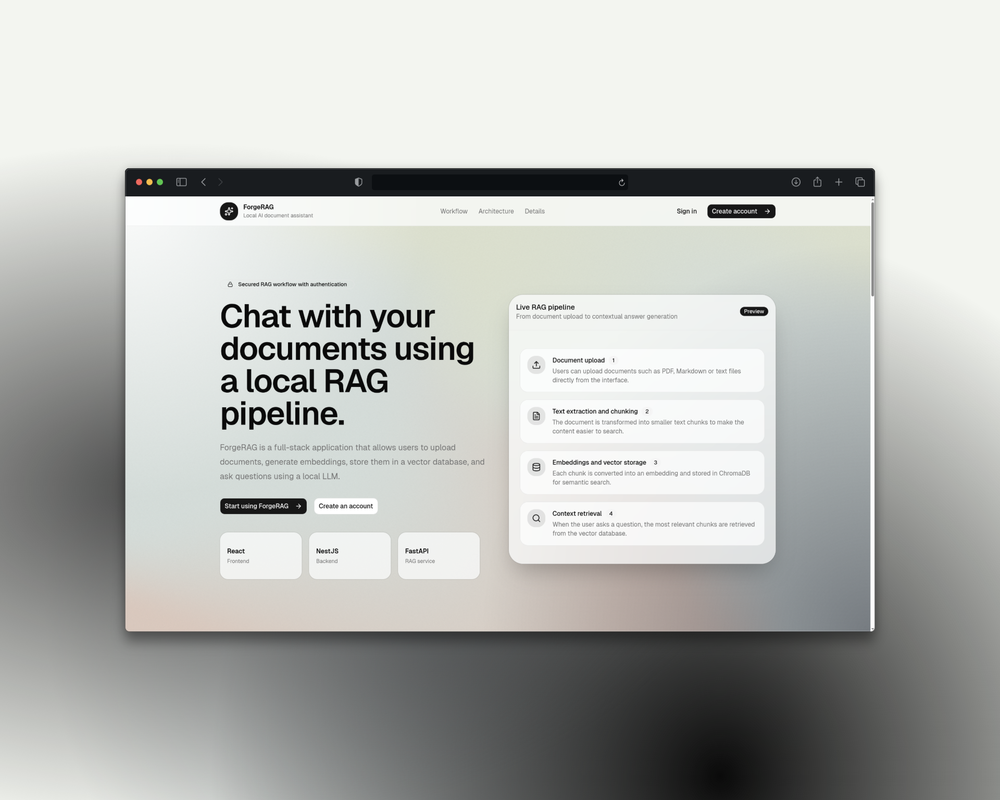
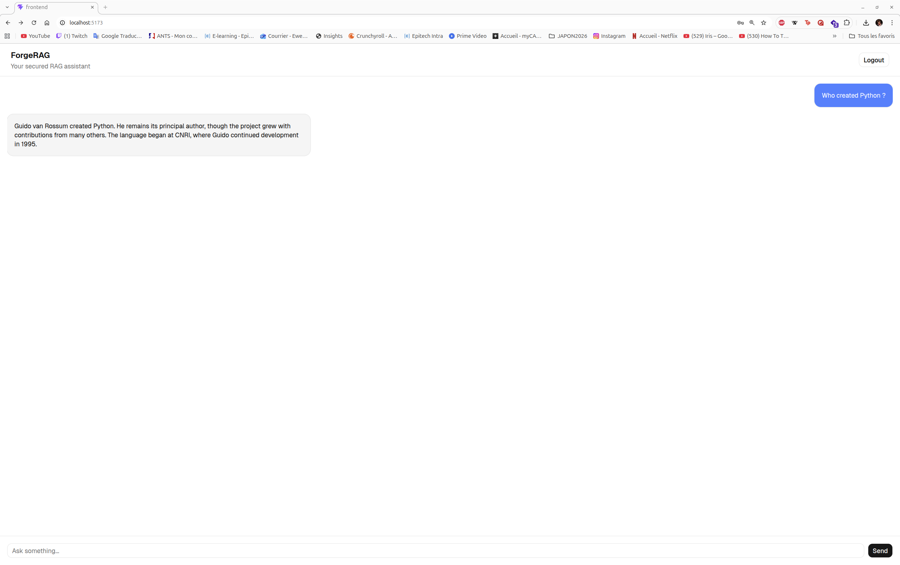

# 🚀 ForgeRAG

ForgeRAG is a fullstack Retrieval-Augmented Generation (RAG) application built around a modern web interface, a secure NestJS backend, and a local AI pipeline.

The goal of the project is to let users upload their own documents, ask questions about them, and receive contextual answers generated by a local LLM. ForgeRAG focuses on privacy, local-first AI usage, document-based answers, source transparency, and a clean ChatGPT-like user experience.




---

## ✨ Features

### 🔐 Authentication

- User registration and login
- JWT-based authentication
- Protected backend routes
- User-specific conversation history
- Token stored on the frontend side for authenticated API calls

### 📄 Document Ingestion

- Upload documents from the frontend
- Supported formats for now:
  - `.pdf`
  - `.txt`
  - `.md`
- PDF text extraction and cleaning
- Text normalization before chunking
- Configurable chunk size and chunk overlap

> Planned document formats: `.docx` and `.xml`.

### 🧠 RAG Pipeline

- Text chunking
- Embedding generation
- Vector storage with ChromaDB
- Semantic search over uploaded documents
- Context retrieval from the most relevant chunks
- Contextual answer generation based on retrieved sources

### 🤖 Local AI Generation

- Local LLM integration through LM Studio
- OpenAI-compatible API usage
- Local embedding model support
- Prompt-based contextual answering
- Answers generated only from retrieved context

### 💬 Frontend UI

- React + Vite frontend
- TailwindCSS styling
- shadcn/ui components
- ChatGPT-like interface
- Real-time streaming display
- Source visualization with excerpts
- Conversation history displayed after reload

### 🛠️ Developer Tools

- Docker-based development setup
- FastAPI service for the RAG pipeline
- NestJS backend as the secure API gateway
- Prisma ORM with PostgreSQL
- ChromaDB persistent vector store
- Health check endpoints

---

## 🏗️ Architecture

```txt
Frontend (React + Vite)
        ↓
Backend API (NestJS + JWT + Prisma)
        ↓
RAG Service (FastAPI)
        ↓
Embedding Model / LLM (LM Studio)
        ↓
ChromaDB (Vector Database)
```

### Service responsibilities

| Service | Role |
| --- | --- |
| Frontend | User interface, authentication screens, chat page, upload UI, source display |
| Backend | Authentication, JWT protection, history persistence, API gateway to the RAG service |
| RAG Service | File ingestion, text extraction, chunking, embedding, retrieval, answer generation |
| PostgreSQL | User accounts and conversation history |
| ChromaDB | Vector storage for document chunks |
| LM Studio | Local LLM and embedding model provider |

---

## 🐳 Tech Stack

### Frontend

- React
- Vite
- TypeScript
- TailwindCSS
- shadcn/ui
- Sonner toasts

### Backend

- NestJS
- TypeScript
- Prisma ORM
- PostgreSQL
- JWT authentication
- bcrypt password hashing

### RAG Service

- Python
- FastAPI
- ChromaDB
- pypdf
- OpenAI-compatible client
- Local embeddings

### AI

- LM Studio
- Local chat model
- Local embedding model
- OpenAI-compatible API

---

## ⚙️ Requirements

Before running ForgeRAG, make sure you have:

- Docker
- Docker Compose
- LM Studio installed locally
- A local chat model loaded in LM Studio
- A local embedding model loaded in LM Studio

Recommended models used during development:

- Chat model: `qwen/qwen3-vl-4b`
- Embedding model: `text-embedding-nomic-embed-text-v1.5`

---

## 🚀 Getting Started

### 1. Clone the repository

```bash
git clone <repo-url>
cd ForgeRAG
```

### 2. Configure environment variables

Create your environment files according to your project setup.

Example:

```env
DATABASE_URL=postgresql://user:password@db:5432/forgerag
JWT_SECRET=change-me-in-production

RAG_SERVICE_URL=http://rag-service:8000

OPENAI_BASE_URL=http://host.docker.internal:1234/v1
OPENAI_API_KEY=lm-studio
LLM_MODEL=qwen/qwen3-vl-4b
EMBEDDING_MODEL=text-embedding-nomic-embed-text-v1.5
```

> On Linux, Docker may need an explicit `host.docker.internal` mapping depending on your Docker setup.

### 3. Start LM Studio

In LM Studio:

1. Load your chat model.
2. Load or enable your embedding model.
3. Start the local API server.
4. Enable local network access if the RAG service runs inside Docker.

The default API URL expected by the services is:

```txt
http://host.docker.internal:1234/v1
```

### 4. Start the application

```bash
docker compose up --build
```

### 5. Access the services

| Service | URL |
| --- | --- |
| Frontend | http://localhost:5173 |
| Backend API | http://localhost:3000 |
| RAG Service | http://localhost:8000 |

---

## 🧪 Usage

1. Open the frontend.
2. Register a new account.
3. Login.
4. Upload a supported document.
5. Ask a question about the uploaded document.
6. Receive a streamed answer.
7. Expand the sources to inspect the chunks used as context.
8. Reload the page to see your conversation history.

---

## 🔌 API Overview

### Backend API

Base URL:

```txt
http://localhost:3000/api
```

| Method | Endpoint | Description | Auth |
| --- | --- | --- | --- |
| `GET` | `/health` | Backend and database health check | No |
| `POST` | `/auth/register` | Register a new user | No |
| `POST` | `/auth/login` | Login and receive an access token | No |
| `POST` | `/rag/query` | Ask a RAG question | Yes |
| `GET` | `/rag/history` | Get authenticated user history | Yes |
| `GET` | `/rag/stream?question=...` | Stream an answer with SSE | No / WIP protection |

### RAG Service API

Base URL:

```txt
http://localhost:8000
```

| Method | Endpoint | Description |
| --- | --- | --- |
| `GET` | `/health` | RAG service health check |
| `POST` | `/generate` | Generate a direct LLM answer |
| `POST` | `/embed` | Generate an embedding |
| `POST` | `/ingest` | Ingest raw text |
| `POST` | `/documents/upload` | Upload and ingest a document |
| `POST` | `/retrieve` | Retrieve relevant chunks |
| `POST` | `/rag/query` | Retrieve context and generate an answer |
| `GET` | `/vector-store/count` | Count stored chunks |
| `GET` | `/vector-store/peek` | Inspect stored chunks |
| `DELETE` | `/vector-store/reset` | Reset the ChromaDB collection |

---

## 📂 Project Structure

```txt
ForgeRAG/
├── frontend/
│   └── src/
│       ├── components/
│       │   ├── ui/
│       │   ├── ChatInput.tsx
│       │   ├── ChatMessage.tsx
│       │   └── SourceList.tsx
│       ├── pages/
│       │   ├── ChatPage.tsx
│       │   ├── LoginPage.tsx
│       │   └── RegisterPage.tsx
│       └── services/
│           └── api.ts
│
├── backend/
│   └── src/
│       ├── auth/
│       ├── rag/
│       ├── prisma/
│       ├── app.module.ts
│       └── main.ts
│
├── rag-service/
│   └── app/
│       ├── models/
│       ├── services/
│       │   ├── chunking_service.py
│       │   ├── embedding_service.py
│       │   ├── file_ingestion_service.py
│       │   ├── lmstudio_client.py
│       │   ├── rag_pipeline.py
│       │   └── vector_store.py
│       └── main.py
│
├── screenshots/
│   └── forge-rag-chat.png
│
└── docker-compose.yml
```

---

## 🧠 How the RAG Flow Works

```txt
User uploads a document
        ↓
The RAG service extracts text from the file
        ↓
The text is cleaned and split into chunks
        ↓
Each chunk is embedded using a local embedding model
        ↓
Chunks and metadata are stored in ChromaDB
        ↓
The user asks a question
        ↓
The question is embedded
        ↓
ChromaDB retrieves the most relevant chunks
        ↓
The retrieved context is sent to the local LLM
        ↓
The answer is streamed back to the frontend
        ↓
The sources are displayed to the user
```

---

## ✅ Current Status

- Authentication system is working
- Register and login flows are available
- JWT-protected backend routes are implemented
- PostgreSQL connection through Prisma is working
- RAG service can ingest supported documents
- PDF extraction and cleaning are implemented
- Text chunking with overlap is implemented
- Embeddings are generated through LM Studio
- ChromaDB stores and retrieves document chunks
- RAG answers are generated from retrieved context
- Sources are returned with answers
- SSE streaming is available
- Conversation history is stored and displayed
- Docker development workflow is available

---

## 🔮 Roadmap

### Short-term

- Add `.docx` ingestion
- Add `.xml` ingestion
- Protect the SSE streaming route with authentication
- Improve upload loading states
- Improve source display and highlighting
- Add better error handling for missing LM Studio models

### Mid-term

- Multi-conversation support
- Sidebar with chat sessions
- Document management page
- Delete documents from the vector store
- Per-user document isolation in ChromaDB
- Better prompt templates
- Better citations in generated answers

### Long-term

- Deployment-ready Docker configuration
- Cloud deployment documentation
- Role-based access control
- Admin dashboard
- Multi-user scaling
- Model provider abstraction
- Evaluation pipeline for RAG quality

---

## 🔒 License

This project is licensed under the **PolyForm Noncommercial License 1.0.0**.

You may use, modify, and contribute to this project for noncommercial purposes. Commercial use is not permitted without explicit written permission from the author.

For commercial licensing, partnerships, or professional usage, please contact the author.

See the `LICENSE` file for the full license text.

---

## 👨‍💻 Author

**Ewen Emeraud**

Fullstack Developer | AI & Cybersecurity Enthusiast

- GitHub: `https://github.com/ewen1507`
- LinkedIn: `https://www.linkedin.com/in/ewen-emeraud/`
- Malt: `https://www.malt.fr/profile/ewenemeraud`

---

## 📸 Screenshot


